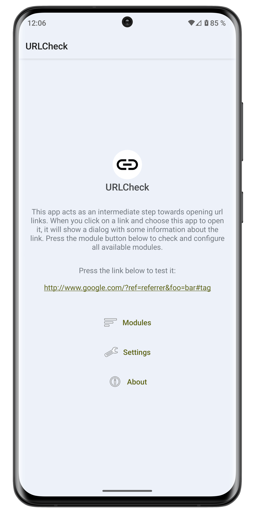
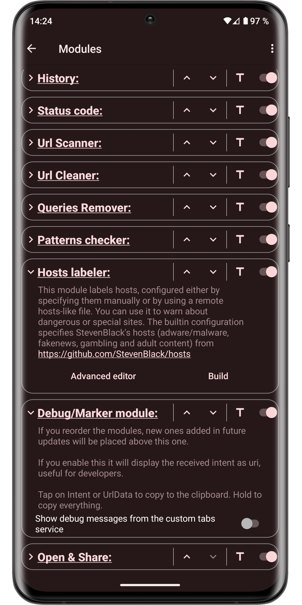

<!-- ---------- Header ---------- -->

<!-- title -->
# URL Shield

<!-- ---------- Description ---------- -->
**URL Shield** acts as an amazingly customizable and powerful intermediary when opening url links, allowing, among other things:
to remove trackers, affiliate links, unnecessary elements, check Hosts, facilitating link holding and sharing, protecting against certain phishing techniques and many more...

<!-- ---------- Screenshots ---------- -->

<!--

  
  
  
  
  
  
  
  

-->

